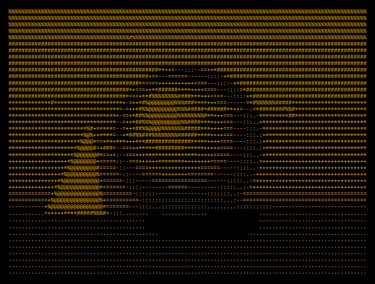

# Atelier ░▒▓█ ASCII

**ASCII art that looks drawn by hand.** Turn any image, video or webcam feed into character art,
touch it up by hand, and export it straight to GitHub, Discord, your terminal, a GIF or a video.
Everything runs in your browser, and your images never leave your device.

<p align="center">
  
</p>

[](LICENSE)


## Features

- **Characters chosen by shape, not just darkness.** Shape mode compares every cell with the
  outline of each glyph, so a diagonal becomes a slash and a lower edge becomes an underscore.
- **Six modes:** Tones `░▒▓█`, Shape `.d8b`, Text `ABC`, 1-bit, Braille `⣿⣶⣤⣀` and Edges `/|\-`.
- **Portraits written in your own words.** Draw an image with a name, a quote or any line of
  text, with brightness setting how bold each letter looks.
- **Live video and webcam.** Convert in real time, record clips of up to ten seconds, or loop a
  still image with effects like decode, rain, scan and wave.
- **Darkroom-style tone controls:** auto levels, invert, and Floyd–Steinberg, Atkinson or Bayer
  dithering.
- **Edit by hand.** Paint characters, erase the background or type a signature onto the canvas.
  Edits stay in place while you keep adjusting tone and width.
- **Three themes:** Paper, Phosphor and Blueprint.
- **Keyboard driven.** Press `?` in the studio for the full list of shortcuts.

### Exports

| Destination     | What you get                                     |
| --------------- | ------------------------------------------------ |
| GitHub README   | A code block that survives Markdown              |
| Discord         | Checked against the 2,000-character limit        |
| Slack           | Sized so it doesn't wrap                         |
| Terminal        | 24-bit ANSI color for banners and CLIs           |
| Email signature | Inline-styled HTML that pastes cleanly           |
| Web embed       | One self-contained `<pre>` tag                   |
| PNG / SVG       | Sharp raster images or vectors for poster sizes  |
| GIF / MP4       | Seamless loops and videos ready for social media |

## Privacy

There are no uploads, accounts or servers doing the work. Conversion, recording and encoding all
happen on your device. The only network requests the page makes are for web fonts and for the
GitHub star count shown next to the GitHub buttons.

## Getting startedConfiguration

You need [Node.js](https://nodejs.org) 20.9 or newer.

```bash
git clone https://github.com/D1R0/Atelier-ASCII.git
cd Atelier-ASCII
npm install
npm run dev
```

Open http://localhost:3000.

## Project layout

```
app/
  layout.tsx     page metadata, fonts, Open Graph image
  page.tsx       renders the landing page and studio markup on the server
  markup.html    the HTML for the landing page, studio and export dialog
  globals.css    all styles
  icon.svg       favicon
public/
  atelier.js     the engine: conversion, editing, animation, GIF/video export
  og.png         preview image for links shared on social media
docs/
  demo.gif       sample animation shown in this README
site.config.ts   repository URL
```

## Deployment

The camera only works over HTTPS, so make sure your deployment uses it.

### Vercel

1. Push the repository to GitHub.
2. On [vercel.com](https://vercel.com), click **Add New → Project** and pick the repository.
3. Click **Deploy**. No build settings are needed.
4. Under **Settings → Environment Variables**, add `NEXT_PUBLIC_SITE_URL` with your final address,
   then redeploy so link previews use the right URL.
5. Under **Settings → Domains**, add your own domain if you have one.

### Your own server (Ubuntu VPS)

```bash
# Install Node.js 20, Nginx and PM2
curl -fsSL https://deb.nodesource.com/setup_20.x | sudo -E bash -
sudo apt install -y nodejs nginx
sudo npm install -g pm2

# Build and start the app
cd /var/www/atelier-ascii
npm install
NEXT_PUBLIC_SITE_URL=https://yourdomain.com npm run build
pm2 start npm --name atelier -- start
pm2 save && pm2 startup
```

Put Nginx in front of it (`/etc/nginx/sites-available/atelier`):

```nginx
server {
  server_name yourdomain.com;
  location / {
    proxy_pass http://127.0.0.1:3000;
    proxy_set_header Host $host;
    proxy_set_header X-Forwarded-Proto $scheme;
  }
}
```

```bash
sudo ln -s /etc/nginx/sites-available/atelier /etc/nginx/sites-enabled/
sudo nginx -t && sudo systemctl reload nginx
sudo apt install -y certbot python3-certbot-nginx
sudo certbot --nginx -d yourdomain.com   # free HTTPS
```

To update later: `git pull && npm run build && pm2 restart atelier`.

### Static hosting (GitHub Pages, Netlify, cPanel…)

The app doesn't need a server, so it can also be exported as plain files.

1. In `next.config.mjs`, uncomment `output: "export"`.
2. Run `npm run build`. This creates an `out/` folder.
3. Upload the contents of `out/` to your site's root (for example `public_html`).

In this mode the custom headers in `next.config.mjs` are not applied, so the `Permissions-Policy`
header that allows the camera has to be set by your host if it restricts camera access.

## Contributing

Contributions are welcome. Open an issue to discuss an idea or report a bug, or send a pull
request. Please keep the app fully client-side: images should never leave the user's browser.

## License

[MIT](LICENSE) © The Atelier ASCII contributors
